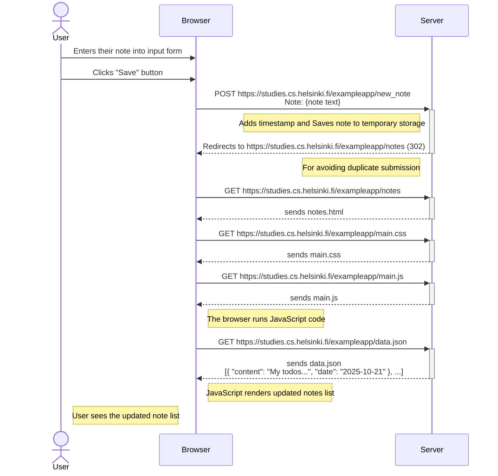

## 0.4: New Note

```mermaid
sequenceDiagram
    actor User 
    participant Browser
    participant Server 

    User->>Browser: Enters their note into input form
    User->>Browser: Clicks "Save" button
    
    Browser->>+Server: POST https://studies.cs.helsinki.fi/exampleapp/new_note <br/> Note: {note text}
    Note left of Server: Adds timestamp and Saves note to temporary storage
    Server-->>-Browser: Redirects to https://studies.cs.helsinki.fi/exampleapp/notes (302)
    Note left of Server: For avoiding duplicate submission
    Browser->>+Server: GET https://studies.cs.helsinki.fi/exampleapp/notes
    Server-->>-Browser: sends notes.html
    
    Browser->>+Server: GET https://studies.cs.helsinki.fi/exampleapp/main.css
    Server-->>-Browser: sends main.css
    
    Browser->>+Server: GET https://studies.cs.helsinki.fi/exampleapp/main.js
    Server-->>-Browser: sends main.js
    
    Note right of Browser: The browser runs JavaScript code
    
    Browser->>+Server: GET https://studies.cs.helsinki.fi/exampleapp/data.json
    Server-->>-Browser: sends data.json <br/> [{ "content": "My todos...", "date": "2025-10-21" }, ...]
    
    Note right of Browser: JavaScript renders updated notes list
    
    Note right of User: User sees the updated note list
```